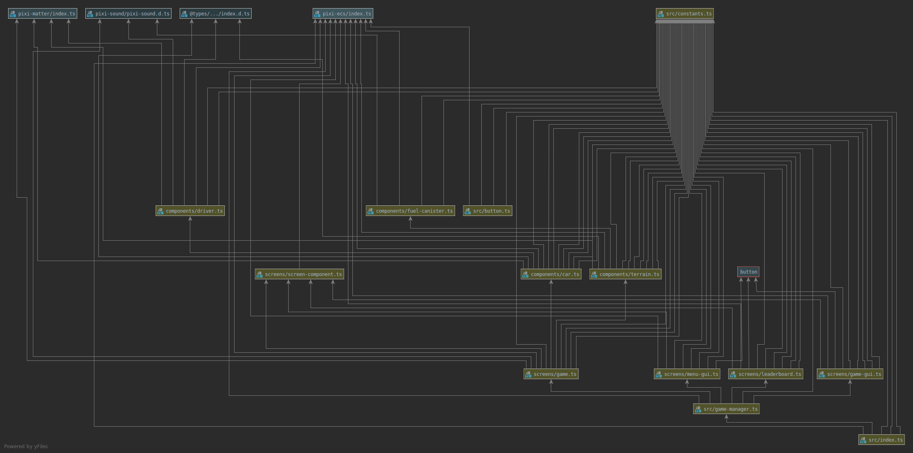

# Full Spead Ahead (FSA)
**Full Spead Ahead** is Hill Climb Racing like game. Goal of the game is to ride 
as far as possible without toppling over or running out of fuel.  

Semester project for NI-APH at CTU in Prague.

## Controls 
> Arrow left - **Move Forward** 
> Arrow right - **Move Backward** 

## Deployment
Game is deployed on Heroku: https://ni-aph-fsa.herokuapp.com/ 
Reaload a few times might be necessary.

## Localhost
> Install game requirements: npm install 
> To run game on http://localhost:1234/: npm run start

## Class Diagram

Among the key classes are *Game.ts*, *Car.ts* and *Terrain.ts* which represent most of the
game play. Entire game is directed by *GameManager.ts* class which controls 
the switching of screens. Lifecycle of the game is from ECS library (**pixi-ecs**) and
physics is implemented using **matter.js** library.

